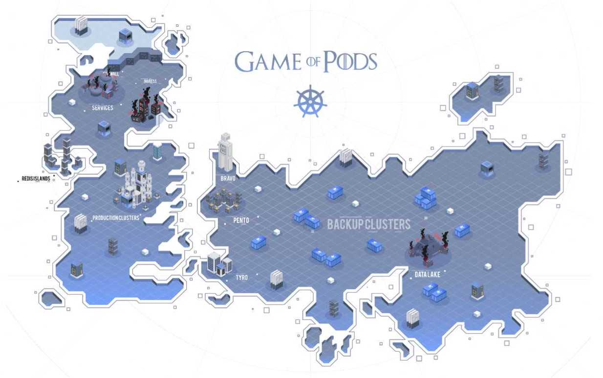

# Game of Pods by KodeKloud

  

**Link to game**: https://kodekloud.com/p/game-of-pods

**Author**: Vijin Palazhi

## Level passwords
- **[Bravo](https://github.com/5kr1p7/game-of-pods/raw/master/solutions/bravo.yaml)**: `Nyk skan jiva schedulara! Zer poda! Zer poda! Zer poda!`
- **[Pento](https://github.com/5kr1p7/game-of-pods/raw/master/solutions/pento.yaml)**: `Aksios Podo, ilon misas! Kesrio syt logis zobrie issa se ossyngnoti errars`
- **[Redis Islands](https://github.com/5kr1p7/game-of-pods/raw/master/solutions/redis-islands.yaml)**: `Sikudi nopazmi! Valar dohaeris episierve!`
- **[Tyro](https://github.com/5kr1p7/game-of-pods/raw/master/solutions/tyro.yaml)**: `Zyhys perzys stepagon schedulara Oño resarc, se poda lys qelitsos sikagon`
- **[Iron Gallery](https://github.com/5kr1p7/game-of-pods/raw/master/solutions/iron-gallery.yaml)**: `yamlio muño engos ñuhys issa. Avy jorraelan, yamlio!`
- **[Voting app](https://github.com/5kr1p7/game-of-pods/raw/master/solutions/voting-app.yaml)**: `Hen desarrollo, integreiddio. Hen integreiddio, testa. Hen testa, lifa.`
